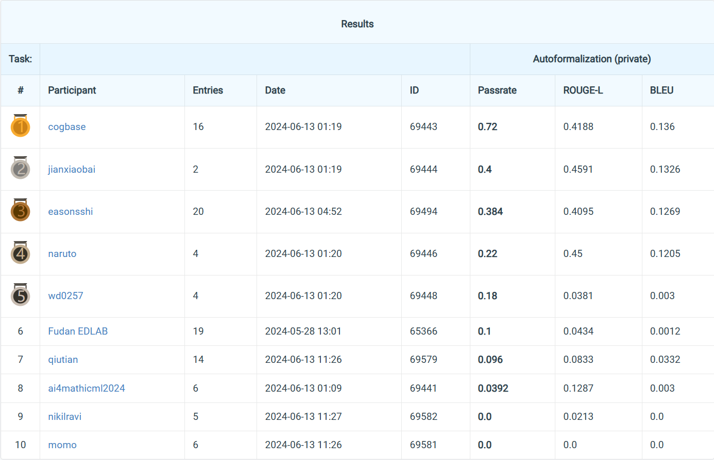
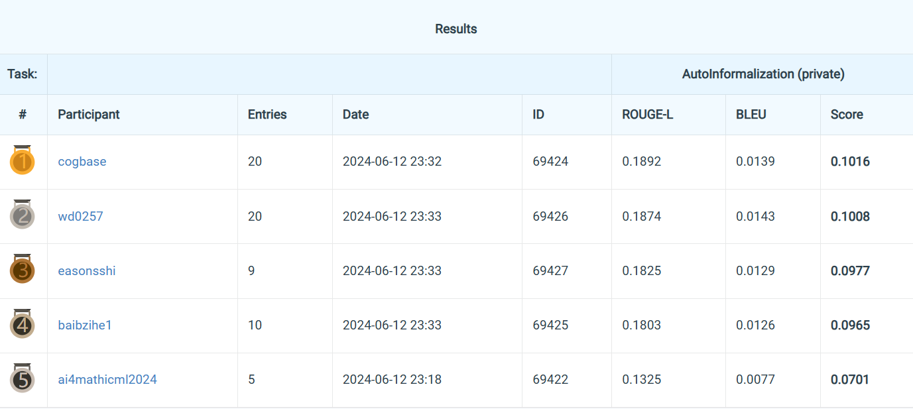

# Cogbase Team's Winning Solution for ICML 2024 Challenges on Automated Math Reasoning

Welcome to the Cogbase team's repository for our winning solution in the ICML 2024 Challenges on Automated Math Reasoning, specifically for CHALLENGE - TRACK 1: AUTOFORMALIZATION & AUTO-INFORMALIZATION.

Competition Link: [ICML 2024 AI for Math Workshop Challenges](https://sites.google.com/view/ai4mathworkshopicml2024/challenges)

## Overview

This repository contains the code for our champion solution in the Automated Math Reasoning challenges. Our approach excelled in both Track 1-1: AUTOFORMALIZATION and Track 1-2: AUTO-INFORMALIZATION, securing the 1st place in both tracks.

## Final Results

The final results for each track are depicted in the following figures:

- Track 1-1: AUTO-FORMALIZATION
  

- Track 1-2: AUTO-INFORMALIZATION
  

## Usage

Todo